# BeTiSe — Paper Appendix

Supplementary material for *BeTiSe: A Comprehensive Benchmark Dataset for Univariate Time Series Stationarity and Structural Analysis* (ITISE 2026).

- Dataset (CSV via Zenodo): https://doi.org/10.5281/zenodo.18513505
- Python package: https://pypi.org/project/betise/

## Appendix A — Database and Metadata Schema

The BeTiSe library stores generated series in `dataset_generation.zip` using both CSV and Apache Parquet formats. The generation logic is contained within `Data_Generation.ipynb`. Each series is accompanied by a metadata record that enables granular analysis of model performance across specific time-series characteristics.

### A.1 Labeling and Column Definitions

Binary flags indicate the presence (1) or absence (0) of a specific characteristic.

| Column Name | Statistical or Structural Meaning |
|---|---|
| `data` | Time-ordered values (Z-normalized). |
| `stationary` | Set to 1 for raw, stationary baseline series. |
| `det_lin_up` | Deterministic linear upward trend. |
| `det_lin_down` | Deterministic linear downward trend. |
| `det_quad` | Quadratic (parabolic) trend components. |
| `det_cubic` | Cubic (S-shaped) growth dynamics. |
| `det_exp` | Nonlinear exponential growth or decay. |
| `det_damped` | Directional trend with exponential damping. |
| `stoc_trend` | Stochastic processes (RW, RWD, ARI, IMA, ARIMA). |
| `volatility` | Time-varying variance (ARCH, GARCH, EGARCH, APARCH). |
| `single_seas` | Periodic patterns with a single dominant frequency. |
| `multiple_seas` | Patterns containing multiple cyclic frequencies. |
| `seasonal_base` | Seasonality derived from SARMA or SARIMA models. |
| `point_anom_single` | Isolated, sudden point-wise deviation. |
| `point_anom_multi` | Multiple uncorrelated point-wise deviations. |
| `collect_anom` | Sustained deviations over a temporal segment. |
| `context_anom` | Pattern inversions within seasonal structures. |
| `mean_shift` | Permanent shift in the series mean level. |
| `var_shift` | Permanent change in the variance (scale). |
| `trend_shift` | Abrupt change in slope or trend direction. |

### A.2 Data Generation Parameters

The base series coefficients are sampled to ensure stationarity and invertibility. For example, AR coefficients are typically sampled from U(−0.9, 0.9) with the exclusion of the range (−0.3, 0.3) to ensure statistically significant patterns. Trends are scaled relative to the series length *L* to maintain visual and statistical consistency across short (*L* ∈ [50, 100]), medium (*L* ∈ [300, 500]), and long (*L* ∈ [1000, 10,000]) series.

## Appendix B — Data Generation Templates

Representative templates used to construct the BeTiSe dataset, ranging from isolated statistical properties to complex combinations of trends, breaks, and anomalies.

| ID | Trend Type | Structural Break | Seasonality | Volatility | Anomaly Type | Model Type | Notes |
|---|---|---|---|---|---|---|---|
| 1 | None | None | None | None | None | AR(1), MA(1) | Stationary base series |
| 2 | Linear ↑ | None | None | None | None | Linear + WN | Deterministic upward trend |
| 3 | Linear ↓ | None | None | None | None | Linear + WN | Deterministic downward trend |
| 4 | Quadratic | None | None | None | None | Quadratic + WN | Parabolic growth dynamics |
| 5 | RW w/ Drift | None | None | None | None | RW, ARIMA(1,1,1) | Stochastic trend component |
| 6 | None | Mean Shift (at 500) | None | None | None | ARMA(2,2) | Single structural level shift |
| 7 | None | Var. Shift (at 750) | None | None | None | AR(2) + GARCH | Sudden variance increase |
| 8 | None | Trend Shift (at 500) | None | None | None | AR + Linear Slope | Piecewise trend change |
| 9 | None | None | Single | None | None | SARMA(1,0,0) | Monthly seasonal pattern |
| 10 | None | None | Multi (Fourier) | None | None | Fourier + WN | Combined daily/weekly cycles |
| 11 | None | None | None | GARCH | None | ARMA + GARCH | Clustered volatility |
| 12 | None | None | None | EGARCH | None | MA + EGARCH | Asymmetric volatility dynamics |
| 13 | None | None | Single | None | Point (at 500) | SARMA + Anomaly | Sudden outlier drop |
| 14 | None | None | Single | None | Multi-Point | SARMA + Anomaly | Outliers at multiple indices |
| 15 | None | None | Multi | None | Collective | SARIMA + Anomaly | Gradual seasonal pattern shift |
| 16 | None | None | Multi | None | Contextual | Fourier + Anomaly | Outlier at seasonal peak |
| 17 | Cubic | Trend Shift (at 500) | Multi | GARCH | Point (at 500) | ARIMA + GARCH | 5-tuple non-stationary case |
| 18 | Linear ↑ | Mean Shift (at 500) | None | None | Point (at 750) | Linear + ARMA + Anom | Triple: Trend, Shift, and Outlier |

## Appendix C — LLM Prompts for Zero-Shot Classification

### C.1 Stationary vs. Non-Stationary Classification Prompt

**System Prompt:**
You are a helpful assistant.

**Feature Hierarchy:**
HIERARCHY OF TIME-SERIES FEATURES:

1. **STATIONARY:** Mean approximately constant over time; Variance approximately constant; No persistent trend or drift; Fluctuates around a stable level.
2. **NON-STATIONARY:** Presence of trend, drift, or evolving level; Mean or variance changes over time; Structural breaks or regime shifts; Long-term upward or downward movement.

**Allowed Labels:** Stationary, Non-Stationary

**Classification Prompt:**
You are an expert in time-series feature identification. Given an observation (a univariate series), decide which SINGLE feature from the allowed set best describes the series' MOST PROMINENT characteristic. Use the hierarchy for reasoning and keep the response concise.

**Decision Rule:**
- If there is any clear long-term trend, drift, or level change, choose Non-Stationary.
- Only choose Stationary if the series clearly fluctuates around a constant level with stable variance.
- When uncertain, prefer Stationary.

**Format:**
Action: Boxed {\<one label from the allowed set above\>}

### C.2 Five-Class Time-Series Feature Classification Prompt

**System Prompt:**
You are a helpful assistant.

**Feature Hierarchy:**
HIERARCHY OF TIME-SERIES FEATURES:

1. **Deterministic Trends:** Linear (constant rate), Quadratic (curved trajectory), Cubic (complex patterns/direction changes), Exponential (exponential growth/decline), Damped (starts strong but slows).
2. **Stochastic Trends:** Trends incorporating random fluctuations influenced by external shocks.
3. **Structural Breaks:** Abrupt changes: Mean Shift (average level change), Variance Shift (variability change), Trend Shift (direction/magnitude change).
4. **Volatility:** High degree of fluctuation or dispersion over time.
5. **Anomaly:** Point Anomaly (single different point), Collective Anomaly (group forming unusual pattern), Contextual Anomaly (abnormal only within specific context).

**Allowed Labels:** Deterministic Trend, Stochastic Trend, Structural Break, Volatility, Anomaly

**Classification Prompt:**
You are an expert in time-series feature identification. Given an Observation (a univariate series), decide which SINGLE feature from the allowed set best describes the series' MOST SALIENT characteristic. Use the hierarchy for reasoning and keep the response concise.

**Format:**
Action: Boxed {\<one label from the allowed set above\>}

## Appendix D — Illustrative Examples of Generated Time Series

### D.1 Series with Two Characteristics Combined

| | |
|---|---|
| 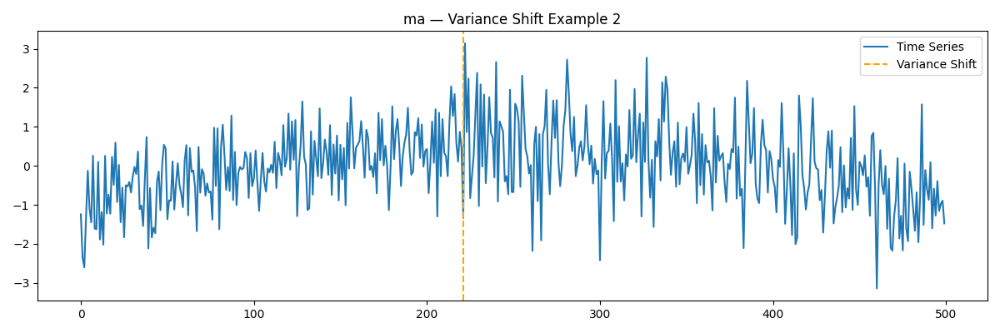 | 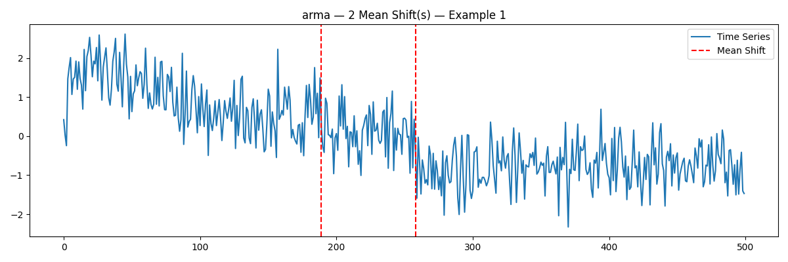 |
| (a) quadratic trend with variance shift | (b) damped trend with 2 mean shifts |
| 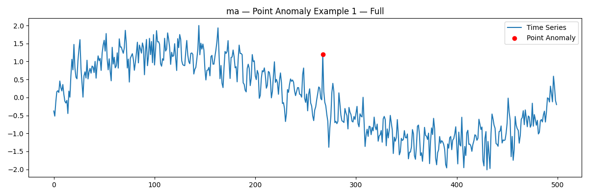 | 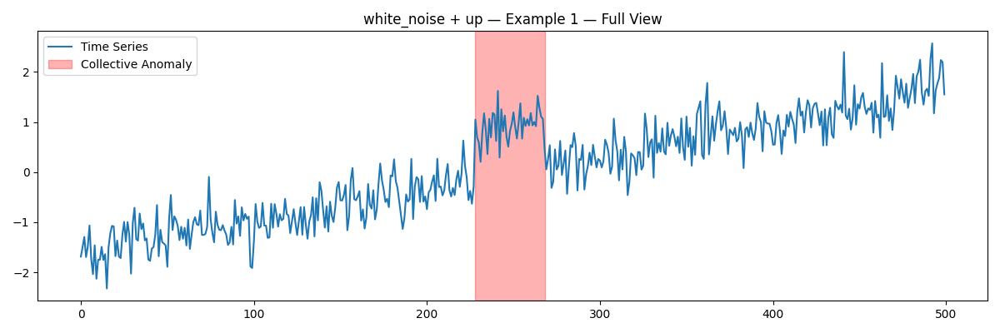 |
| (c) cubic trend with a point anomaly | (d) linear trend with a collective anomaly |

### D.2 Series with Single Characteristics

| | | |
|---|---|---|
| 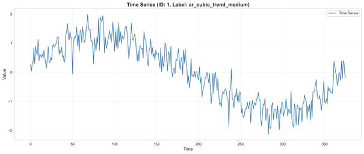 | 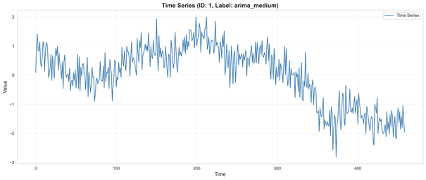 | 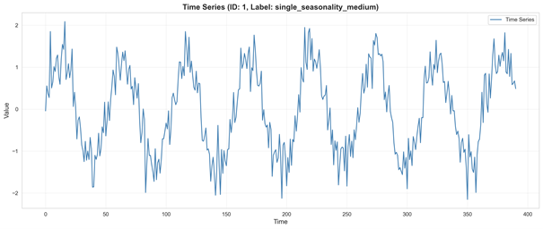 |
| (a) cubic trend | (b) ARIMA series | (c) single seasonality |
| 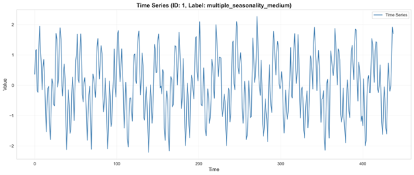 | 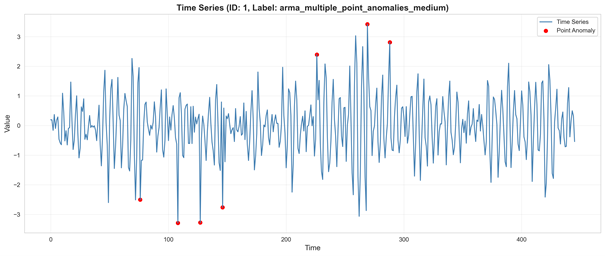 | 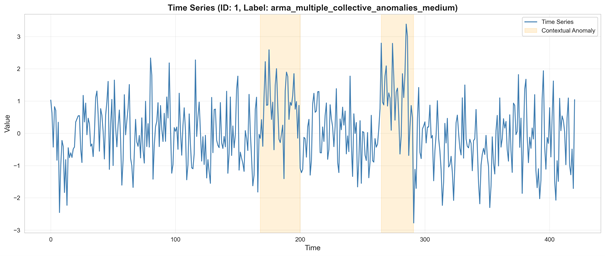 |
| (d) multiple seasonality | (e) multiple point anomalies | (f) multiple collective anomalies |
| 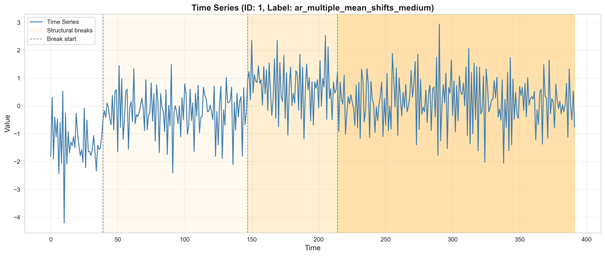 | 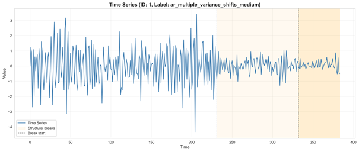 | 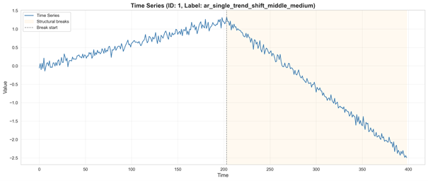 |
| (g) multiple mean shifts | (h) multiple variance shifts | (i) trend shift |
